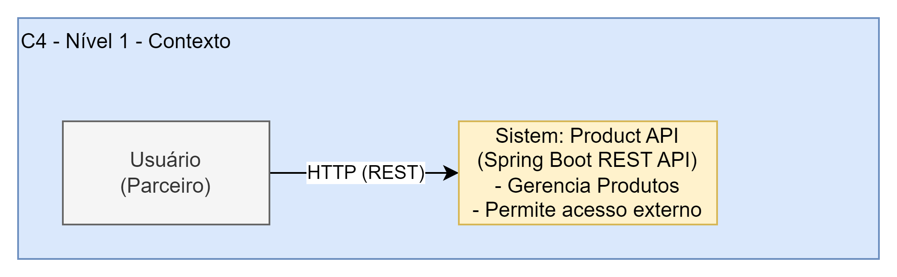
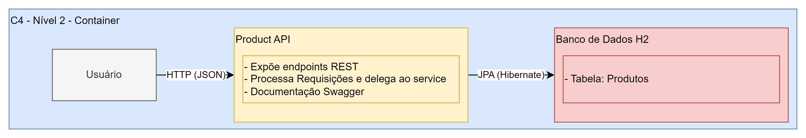
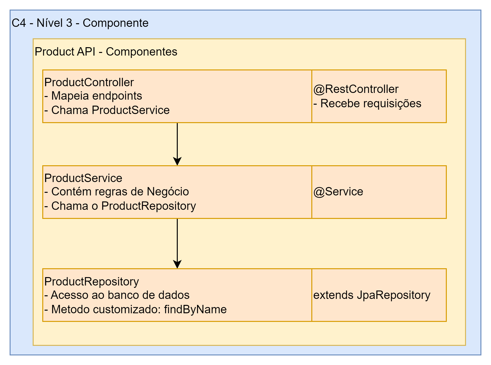
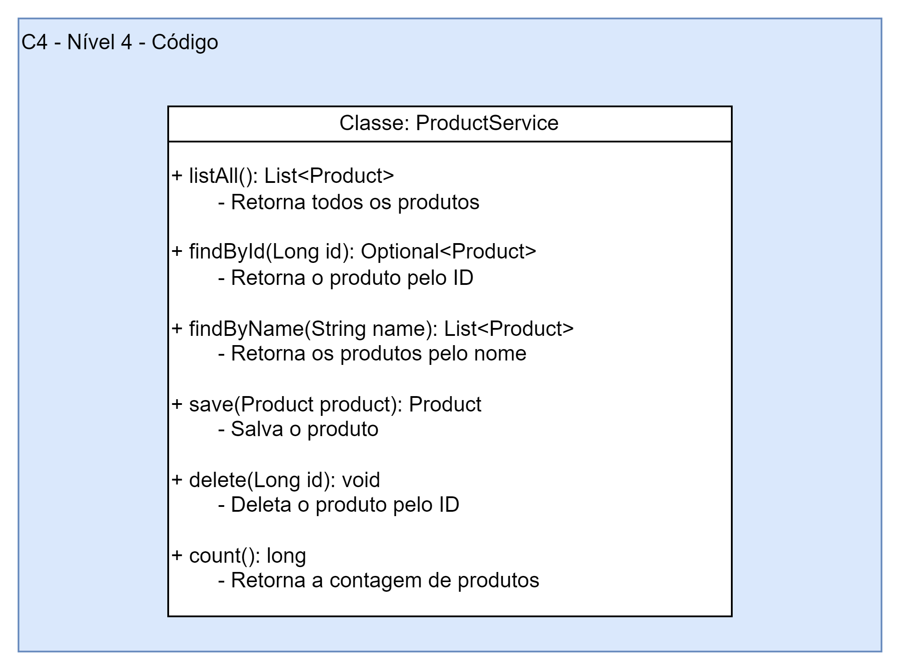

# API de Produto – Spring Boot

API RESTful desenvolvida como parte do desafio final do Bootcamp de Arquiteto(a) de Software. 
A aplicação segue o padrão arquitetural **MVC**, com documentação automatizada via **Swagger**, e utiliza banco de dados H2 em memória.

---

## Funcionalidades

- CRUD completo de produtos
- Buscar produto por ID e por nome
- Contar total de registros
- Documentação automática com Swagger

---

## Tecnologias e Ferramentas

- Java 17
- Spring Boot 3+
- Spring Web
- Spring Data JPA
- H2 Database
- Swagger (springdoc-openapi)
- Maven

---

## Estrutura do Projeto (MVC)

```
src/main/java/com/paulogusttavotognato/productapi
├── controller         # Endpoints REST
│   └── dto            # Classe de transferência de dados
├── exceptions         # Exceções personalizadas
├── model              # Entidade Produto
├── repository         # Interface JPA
├── service            # Regras de negócio
└── ProdutoApiApplication.java
```

---

## Como executar o projeto

1. Clone o repositório:
```bash
git clone https://github.com/tognatopaulo/productapi.git
```

2. Navegue até a pasta e rode a aplicação:
```bash
cd produto-api
./mvnw spring-boot:run
```

---

## Documentação Swagger

Após iniciar a aplicação, acesse:

```
http://localhost:8080/swagger-ui.html
```

A documentação é gerada automaticamente com todos os endpoints e exemplos.

---

## Banco de Dados

A aplicação usa **H2 Database em memória**, e você pode acessá-lo via:

```
http://localhost:8080/h2-console
```

Configurações:
- URL: `jdbc:h2:mem:produtosdb`
- User: `sa`
- Senha: (vazia)

---

## Arquitetura (Modelo C4)

- **Nível 1 – Contexto**: Usuário acessa a API via HTTP

- **Nível 2 – Containers**: Aplicação Spring Boot + H2 Database

- **Nível 3 – Componentes**: Controller, Service, Repository, Model

- **Nível 4 – Código**: Classe ProdutoService com métodos de negócio


---

## Endpoints principais

| Método | Endpoint                    | Descrição                       |
|--------|-----------------------------|---------------------------------|
| GET    | api/v1/products             | Listar todos os produtos        |
| GET    | api/v1/products/{id}        | Buscar produto por ID           |
| GET    | api/v1/products/name/{nome} | Buscar produtos por nome        |
| GET    | api/v1/products/count       | Contar total de produtos        |
| POST   | api/v1/products             | Criar ou atualizar produto      |
| DELETE | api/v1/products/{id}        | Remover produto                 |

---

## Licença

Projeto com fins educacionais. 
Você pode reutilizá-lo livremente para estudos ou como base para projetos profissionais.
